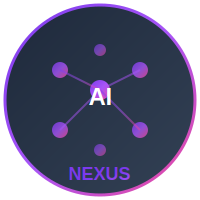

# NEXUS AI - Advanced AI Telegram Bot Platform

<p align="center">
  
</p>

<p align="center">
  🤖 Telegram Bot: [@NexusAiProbot](https://t.me/NexusAiProbot) | 
  🌐 Web App: [GitHub Pages](https://denxvil.github.io/NexusAi/)
</p>

<p align="center">
  
</p>

*Created by ◉Ɗєиνιℓ*

A cutting-edge AI-powered Telegram bot platform featuring **sequential AI provider chain** with Perplexity → Gemini → HuggingFace automatic fallback for maximum reliability.

📱 **Telegram Bot**: [@NexusAiProbot](https://t.me/NexusAiProbot)

## ⚡ Key Innovations

- **🔗 Sequential AI Provider Chain** - Perplexity → Gemini → HuggingFace with automatic fallback
- **✅ Response Verification** - Perfect, powerful, and accurate AI responses
- **🎯 Smart Fallback System** - Ensures reliable responses every time
- **🤖 Advanced Telegram Bot** - Streamlined chat experience with multi-AI integration
- **🔐 Secure API Management** - Environment-based API key configuration

## 🚀 Features

- **🤖 Multi-AI Integration** - Sequential provider chain for maximum reliability
- **💬 Advanced Telegram Bot** - Core chat experience with intelligent AI routing
- **⚡ Real-time Processing** - Fast response times with intelligent routing
- **🔐 Secure Backend** - Express.js API server with comprehensive security
- **📊 MongoDB Integration** - Persistent data storage and user management
- **🌐 Cross-Platform Support** - Works seamlessly across all Telegram clients

## 🏗️ Architecture

```
nexus-ai/
├── 🌐 Frontend (React + TypeScript)
│   ├── frontend/           # React web application
│   │   ├── src/
│   │   │   ├── components/   # React components
│   │   │   ├── context/      # React context providers
│   │   │   ├── services/     # API services
│   │   │   ├── types/        # TypeScript types
│   │   │   └── utils/        # Utility functions
│   │   └── dist/            # Built frontend assets
├── 🔧 Backend (Node.js + TypeScript)
│   ├── server/             # Express.js API server
│   │   ├── src/
│   │   │   ├── controllers/  # API controllers
│   │   │   ├── models/       # MongoDB models
│   │   │   ├── routes/       # API routes
│   │   │   ├── services/     # Business logic
│   │   │   └── bot/          # Telegram bot integration
│   │   └── dist/            # Compiled JavaScript
└── 📋 Deployment
    ├── Dockerfile           # Docker configuration
    ├── docker-compose.yml   # Multi-container setup
    └── render.yaml          # Render deployment config
```

## 🛠️ Tech Stack

### Frontend
- **React 19** - Modern React with latest features
- **TypeScript** - Type-safe development
- **Vite** - Fast build tool and dev server
- **Tailwind CSS** - Utility-first CSS framework
- **React Markdown** - Markdown rendering
- **Lucide React** - Beautiful icon library
- **Axios** - HTTP client for API communication

### Backend
- **Node.js** - Runtime environment
- **Express.js** - Web framework
- **TypeScript** - Type safety and modern JavaScript
- **Socket.io** - Real-time communication
- **MongoDB** - Database for user data and chat history
- **Telegram Bot API** - Bot integration

### AI Services
- **Google Gemini** - Advanced language model
- **Perplexity AI** - Research-focused AI
- **HuggingFace** - Open-source AI models

## 🚀 Quick Start

### Prerequisites
- Node.js 18.x or higher
- MongoDB database
- Telegram Bot Token (from @BotFather)

### Installation

1. **Clone the repository:**
```bash
git clone https://github.com/DenxVil/NexusAi.git
cd NexusAi
```

2. **Install all dependencies:**
```bash
npm run install-all
```

3. **Configure environment variables:**

**Backend Configuration:**
```bash
# Copy example environment file
cp server/.env.example server/.env

# Edit with your configuration
nano server/.env
```

**Frontend Configuration:**
```bash
# Copy example environment file
cp frontend/.env.example frontend/.env.local

# Edit with your configuration
nano frontend/.env.local
```

Add your API keys and configuration:

**Backend (.env):**
```env
# Database Configuration
MONGODB_URI=mongodb://localhost:27017/nexus-ai

# AI Service API Keys
GEMINI_API_KEY=your_gemini_key_here
PERPLEXITY_API_KEY=your_perplexity_key_here
HUGGINGFACE_API_KEY=your_huggingface_key_here

# Telegram Bot Configuration
TELEGRAM_BOT_TOKEN=your_telegram_bot_token_here

# Server Configuration
PORT=5000
NODE_ENV=development
```

**Frontend (.env.local):**
```env
VITE_API_BASE_URL=http://localhost:5000
VITE_AI_API_KEY=your_api_key_here
VITE_APP_NAME=NEXUS AI
```

4. **Start the development servers:**

**Start both frontend and backend:**
```bash
npm run dev:all
```

**Or start individually:**
```bash
# Start backend only
npm run dev

# Start frontend only (in another terminal)
npm run dev:frontend
```

The services will be available at:
- **Web Interface:** http://localhost:3000/NexusAi/
- **API Server:** http://localhost:5000

## 🤖 Telegram Bot Setup

1. **Create a Telegram bot:**
   - Message [@BotFather](https://t.me/botfather) on Telegram
   - Use `/newbot` command to create your bot
   - Save the bot token

2. **Configure the bot:**
   - Add your bot token to the `.env` file in the server directory
   - Start the server: `cd server && npm run dev`
   - Your bot will automatically be available for interactions

3. **Bot Commands:**
   - `/start` - Initialize the bot
   - `/help` - Show available commands
   - `/clear` - Clear chat history
   - Simply send a message to chat with AI

## 📱 Usage

### Web Interface
1. Open your browser and navigate to http://localhost:3000/NexusAi/
2. Start chatting with the AI assistant
3. Use the suggestion buttons for quick prompts
4. View real-time AI responses with markdown formatting

### Telegram Bot
1. Find your bot on Telegram using the username you created
2. Send `/start` to begin
3. Chat naturally - the bot will respond using your configured AI services
4. Use `/help` for additional commands

## 🔧 Configuration

### AI Services Setup

#### Google Gemini
1. Visit [Google AI Studio](https://makersuite.google.com/app/apikey)
2. Create a new API key
3. Add to your environment variables or settings panel

#### Perplexity AI
1. Go to [Perplexity Settings](https://www.perplexity.ai/settings/api)
2. Generate an API key
3. Add to your configuration

#### HuggingFace
1. Visit [HuggingFace Tokens](https://huggingface.co/settings/tokens)
2. Create a new token with read permissions
3. Add to your configuration in the server's `.env` file

## 🚀 Deployment

### GitHub Pages (Frontend)
The frontend is automatically deployed to GitHub Pages:
1. **Configure GitHub repository secrets:**
   - `AI_API_KEY` - Your AI service API key
2. **Push changes to main branch:**
   - Frontend deployment triggers automatically
3. **Access your deployed app:**
   - URL: `https://denxvil.github.io/NexusAi/`

**✅ Current Status**: GitHub Pages deployment is working correctly. The site loads properly with all CSS and JavaScript assets.

### Render Deployment (Backend)
### Render Deployment (Backend)
1. **Prepare for deployment:**
```bash
# Backend is configured for Render deployment
# See render.yaml for configuration
```

2. **Set environment variables in Render:**
```bash
# Configure in Render dashboard
TELEGRAM_BOT_TOKEN=your_token_here
GEMINI_API_KEY=your_key_here
MONGODB_URI=your_mongodb_connection_string
# Add other environment variables as needed
```

3. **Deploy:**
   - Connect repository to Render
   - Backend deploys automatically from main branch

### Verification
Run the deployment verification script to check configuration:
```bash
./verify-deployment.sh
```

### Other Platforms
- **Railway** - Alternative backend deployment option
- **Render** - Backend deployment (see `render.yaml` configuration)

## 📞 Support

Need help? Reach out through our support channels:

- **Telegram:** [@xDenvil_bot](https://t.me/xDenvil_bot)
- **Email:** [NexusAisupport@gmail.com](mailto:NexusAisupport@gmail.com)

## 🤝 Contributing

We welcome contributions! Please feel free to submit a Pull Request. For major changes, please open an issue first to discuss what you would like to change.

### Development Guidelines
1. Fork the repository
2. Create a feature branch (`git checkout -b feature/amazing-feature`)
3. Commit your changes (`git commit -m 'Add some amazing feature'`)
4. Push to the branch (`git push origin feature/amazing-feature`)
5. Open a Pull Request

## 📄 License

This project is licensed under the MIT License - see the [LICENSE](LICENSE) file for details.

## 🙏 Acknowledgments

- **AI Service Providers** - Google, Perplexity, HuggingFace for powerful AI capabilities
- **Open Source Community** - For the amazing libraries and tools
- **Telegram** - For providing an excellent bot platform
- **Contributors** - Everyone who helps make Nexus Ai better

---

**Made with ❤️ by ◉Ɗєиνιℓ**

*Nexus Ai - Where artificial intelligence meets exceptional user experience*
